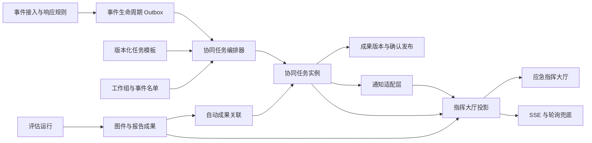

# 工作组任务协同与指挥大厅设计

## 1. 文档状态

- 日期：2026-10-03。
- 所属系统：上海市地震应急评估与辅助决策系统。
- 子系统：工作组任务协同与指挥大厅。
- 当前状态：设计已逐段确认，用户已批准进入实施计划与实施阶段。
- 本阶段范围：正式速报、更正报、人工正式事件、测试事件和演练事件触发后，七个工作组的任务生成、时限管理、成果流转、通知，以及应急指挥大厅总览和分组钻取。
- 本设计不包含：业务代码、数据库迁移、部署实施、AI 问答、现场灾情接入、遥感数据接入、正式多租户和完整指令审批。

本规格承接《上海市地震应急评估与辅助决策系统设计规格》中的任务协同、权限和指挥大厅章节，并消费《专业制图与报告生产中心设计》已经形成的评估、图件和报告成果。出现冲突时，以本规格对工作组协同和指挥大厅行为的定义为准；本规格不得改变现有评估产品和成果生产的验收边界。

## 2. 建设目标

在正式速报到达后，平台自动建立与预案响应等级相匹配的工作组任务，在规定时限内形成系统自动成果、人工补充成果和正式结论，并在应急指挥大厅中向管理者持续展示事件态势、任务进度、超时风险和成果流转状态。

具体目标如下：

- 按预案自动为七个工作组生成任务，不依赖值班人员逐项手工建单。
- 支持震后 30 分钟内、30 分钟至 1 小时、1 至 2 小时、2 小时至应急期结束等阶段任务。
- 支持组长确认发布，组长未到岗时按名单顺序由副组长代理。
- 支持系统自动版、人工修订版和超级管理员覆盖版并存。
- 支持综合协调组和超级管理员下达基础临时任务。
- 支持站内通知可靠送达，并为企业微信、邮件和电话通知预留统一适配端口。
- 支持 `7680 x 2430` 指挥大厅总览和分组、任务详情钻取。
- 保证正式事件优先于测试和演练，所有测试和演练标识不可移除。
- 保留未来为区政府和兄弟省份地震局独立部署时扩展组织、名单、模板和通知配置的能力。

## 3. 已确认的关键决策

| 主题 | 已确认规则 |
| --- | --- |
| 工作组范围 | 新闻信息值守组、监测预报组、综合协调组、震害评估组、应急技术组、后勤保障组、中心站组。 |
| 非平台工作组 | 现场工作队不单列为第八组，由相关工作组抽调；纪检监督组不进入平台成果流转。 |
| 任务生成 | 正式速报入库后自动生成平台任务和评估流程。自动速报只建立待定事件。 |
| 自动评估范围 | 市内有感事件、本市一至四级响应、外省波及上海、距本市边界 20 公里以内，以及融合烈度或预测烈度达到配置阈值的事件。 |
| 其他事件 | 只记录和通知，不生成完整评估任务。 |
| 任务分派 | 默认分派到工作组，不要求个人逐项签收；平台记录实际处理人。 |
| 组长权限 | 组长到岗时由组长确认和发布。 |
| 副组长权限 | 组长未到岗时，按事件名单顺序，由第一位已到岗副组长代理。 |
| 名单维护 | 组长、副组长、副组长顺序和组员关系由平台管理，事件启动时做名单快照。 |
| 成果版本 | 系统自动版和人工修订版并存，确认后指定当前发布版，历史版本不覆盖。 |
| 临时任务 | 首期纳入基础临时任务，不做多级指令审批。 |
| 大屏结构 | 首期采用总览加分组、任务详情钻取，默认展示总态势。 |
| 通知 | 首期站内消息可靠落点，预留企业微信、邮件和电话接口。 |
| 权限原则 | 超级管理员拥有最大权限，可直接覆盖和删除；不启用二次验证。 |
| 真实事件优先 | 正式事件优先于测试和演练，测试和演练标识不可移除。 |

## 4. 名词与时序

### 4.1 主时钟

- `T0`：发震时刻，预案工作组任务的时间基准。
- `T1`：首份正式速报成功入库时刻，自动评估和成果生产的时间基准。
- `task.activated_at`：任务进入可办理状态的时刻。
- `task.due_at`：任务截止时刻。预案任务通常为 `T0 + 模板阶段偏移`。
- `task.completed_at`：组长或有效代理副组长确认完成的时刻。
- `response_ended_at`：经授权用户确认应急响应结束的时刻。

### 4.2 时限口径

- 预案任务以 `T0` 为基准，不使用 `T1` 替代。
- 首次正式报触发的自动评估、图件和报告继续沿用 `T1+5分钟` 验收线。
- 更正报从该份更正报成功入库时刻重新计算 5 分钟，不重置首次 `T1`。
- 协同任务生成不得进入图件和报告的关键生产路径，不得降低现有 300 秒验收要求。

### 4.3 阶段代码

| 阶段代码 | 默认区间 |
| --- | --- |
| `within_30m` | `T0` 至 `T0+30分钟` |
| `30m_to_60m` | `T0+30分钟` 至 `T0+60分钟` |
| `1h_to_2h` | `T0+60分钟` 至 `T0+120分钟` |
| `2h_to_end` | `T0+120分钟` 至应急期结束 |

新闻信息值守组可以增加 `2h_to_4h` 和 `4h_to_end`；其他组的模板按预案原阶段配置，不强制平均拆分。

## 5. 范围与非目标

### 5.1 首期范围

- 工作组定义、成员关系、组长和副组长顺序管理。
- 事件级名单、到岗状态和代理权限快照。
- 版本化预案任务模板。
- 正式报、更正报、人工正式事件、测试和演练事件的任务生成。
- 任务接收、处理、提交、退回、确认、完成、取消和超时。
- 系统自动成果关联、人工成果上传、版本保留和当前发布版指定。
- 基础临时任务。
- 站内通知和外部通知适配端口。
- 指挥大厅总览、分组详情、任务详情和版本查看。
- 审计、幂等、并发控制、错误隔离和数据保留。

### 5.2 明确不在首期范围

- 不开发手机端。
- 不实现公网多租户、计费、跨组织统一身份或跨局数据交换。
- 不自动宣布或结束制度响应。
- 不实现逐级指令签收、回执、升级审批、多级会签和命令撤销审批。
- 不接入现场灾情、遥感解译、内网 EQIM 和独立仪器烈度网段。
- 不替代现有公文、传真、电话和正式对外报送渠道。
- 不替代评估中心、制图中心和报告生产中心的数据模型。
- 不在工作组模块内复制图件、报告或评估产品文件。
- 不实现数据资产中心的导入、校验、发布和回滚流程。

## 6. 总体架构

协同子系统采用模块化单体内的独立模块，保持以下边界：

- `app.collaboration`：工作组、任务模板、任务实例、成果版本、临时任务、到岗和通知意图。
- `app.command_hall`：指挥大厅只读投影、聚合接口和 SSE 事件。
- `app.events`：提供事件、修订、响应建议和 `T1`，并向协同模块发出幂等触发。
- `app.assessment`：继续负责自动评估任务和评估运行。
- `app.artifacts`：继续负责图件、报告、自动成果、重算和超级管理员覆盖。
- `app.auth`：继续负责账号认证；工作组业务权限由协同模块成员关系决定。

模块关系如下：



### 6.1 关键边界

- `AssessmentTask` 只表示评估流水线中的机器任务，不承载工作组人工状态。
- `WorkgroupTask` 表示预案或临时工作组任务，不直接执行评估和渲染。
- 自动成果通过实体 ID、版本号和校验和引用现有成果，不复制文件内容。
- 指挥大厅接口只读取投影和允许的协同表，不在请求内实时聚合完整评估链。
- 通知发送失败不得回滚任务状态。
- 图件或报告失败不得把人工协同任务误标为失败，只显示自动成果缺失或降级。

## 7. 领域模型

### 7.1 工作组与成员

`WorkgroupDefinition`

| 字段 | 说明 |
| --- | --- |
| `code` | 稳定代码，例如 `emergency_technology`。 |
| `name` | 中文名称。 |
| `display_order` | 七个工作组的固定展示顺序。 |
| `is_active` | 是否启用。 |

`WorkgroupMembership`

| 字段 | 说明 |
| --- | --- |
| `user_id` | 账号标识。 |
| `workgroup_code` | 所属工作组。 |
| `duty_role` | `leader`、`deputy`、`member`、`viewer`。 |
| `deputy_order` | 副组长顺序，仅在 `deputy` 时必填。 |
| `effective_from` | 生效时间。 |
| `effective_to` | 失效时间。 |
| `is_active` | 是否有效。 |

约束：

- 一个工作组在同一时间只能有一名有效组长。
- 同一组的有效副组长顺序不得重复。
- 同一用户可承担多个工作组职责时，权限按当前任务所属组和事件快照分别判断。
- 保留现有 `users.role` 和 `users.workgroup` 用于认证和兼容，但协同权限以成员关系和事件快照为准。
- 迁移时按现有 `Users.workgroup` 建立基础成员关系。现有 `group_deputy` 未设置顺序前不具有代理确认权限，由超级管理员补全。

### 7.2 事件名单与到岗

`WorkgroupRosterSnapshot`

| 字段 | 说明 |
| --- | --- |
| `event_id` | 事件标识。 |
| `workgroup_code` | 工作组。 |
| `roster_version` | 事件使用的名单版本。 |
| `roster_fingerprint` | 名单内容指纹。 |
| `snapshot` | 组长、按顺序排列的副组长和组员快照。 |
| `created_at` | 创建时间。 |

`WorkgroupAttendance`

| 字段 | 说明 |
| --- | --- |
| `event_id` | 事件标识。 |
| `workgroup_code` | 工作组。 |
| `user_id` | 到岗人员。 |
| `duty_role_in_snapshot` | 快照中的职责。 |
| `deputy_order_in_snapshot` | 快照中的副组长顺序。 |
| `state` | `unknown`、`present`、`absent`、`departed`。 |
| `checked_in_at` | 到岗时间。 |
| `checked_out_at` | 离岗时间。 |
| `updated_by` | 修改人。 |

代理判定规则：

- 组长状态为 `present` 时，组长拥有确认和发布权限。
- 组长不是 `present` 时，系统取 `present` 中 `deputy_order_in_snapshot` 最小的副组长。
- 若组长和所有副组长均未到岗，平台允许上传和处理，但不允许确认发布，并向本组和应急技术组告警。
- 到岗状态可由本人、本组组长、综合协调组授权人员或超级管理员维护。
- 事件开始后的到岗变化只影响尚未确认的成果，不覆盖已经完成确认的成果。

### 7.3 任务模板

`TaskTemplate`

- `code`：稳定任务代码。
- `title`：任务标题。
- `category`：任务类别。
- `workgroup_code`：责任组。
- `is_active`：是否启用。

`TaskTemplateVersion`

| 字段 | 说明 |
| --- | --- |
| `template_id` | 模板主体。 |
| `version` | 模板版本。 |
| `template_code` | 事件幂等使用的稳定代码。 |
| `phase_code` | 阶段代码。 |
| `start_offset_seconds` | 相对 `T0` 的开始偏移。 |
| `due_offset_seconds` | 相对 `T0` 的截止偏移，持续性任务可为空。 |
| `continues_until_response_end` | 是否延续至应急期结束。 |
| `priority` | 任务优先级。 |
| `required_deliverables` | 必须成果定义。 |
| `optional_deliverables` | 可选成果定义。 |
| `artifact_bindings` | 自动成果键、输出配置和关联方式。 |
| `applicability` | 事件类型、响应等级、空间范围和烈度条件。 |
| `instruction` | 任务说明和预案依据。 |
| `response_basis` | 对应预案或行动清单条款。 |
| `published_at` | 模板版本发布时间。 |

模板版本发布后不可修改。变更必须创建新版本并由事件后续修订决定是否采用。

### 7.4 协同任务

`WorkgroupTask`

| 字段 | 说明 |
| --- | --- |
| `id` | 任务标识。 |
| `event_id` | 关联事件。 |
| `trigger_revision_id` | 触发或修订该任务的事件修订。 |
| `assessment_run_id` | 可选，关联自动评估运行。 |
| `template_version_id` | 预案任务模板版本；临时任务为空。 |
| `task_code` | `template_code` 或临时任务代码。 |
| `source_type` | `preplan`、`correction`、`ad_hoc`、`system_review`。 |
| `source_ref` | 来源单据、操作人或事件 outbox 标识。 |
| `workgroup_code` | 责任组。 |
| `title` | 任务标题。 |
| `instruction` | 任务说明。 |
| `priority` | 优先级，数值越大越优先。 |
| `status` | 生命周期状态。 |
| `timeliness_state` | `on_time`、`at_risk`、`overdue`。 |
| `phase_code` | 阶段。 |
| `activated_at` | 可办理时间。 |
| `due_at` | 截止时间。 |
| `completed_at` | 完成时间。 |
| `closed_at` | 取消或失败等终止时间。 |
| `row_version` | 乐观锁版本。 |
| `created_by` | 创建人或系统。 |
| `updated_at` | 最后修改时间。 |

`WorkgroupTaskContributor`

- 记录实际参与处理的人。
- 首次处理或上传成果时自动写入。
- 不构成个人签收，不要求参与者逐人确认。

### 7.5 成果版本

`TaskDeliverable`

- `task_id`：所属任务。
- `deliverable_code`：任务内稳定成果代码。
- `title`：成果名称。
- `is_required`：是否必须。
- `requirement_kind`：`automatic_artifact`、`manual_file`、`manual_text` 或 `manual_file_or_text`。
- `artifact_binding`：自动成果关联规则。
- `display_order`：展示顺序。

`TaskDeliverableVersion`

| 字段 | 说明 |
| --- | --- |
| `deliverable_id` | 成果主体。 |
| `version_no` | 成果内递增版本。 |
| `source_kind` | `automatic`、`manual`、`superadmin_override`。 |
| `artifact_id` | 系统自动成果标识，可空。 |
| `artifact_publication_id` | 成果发布记录，可空。 |
| `storage_key` | 人工上传对象存储路径，可空。 |
| `file_name` | 文件名。 |
| `checksum` | 内容指纹。 |
| `mime_type` | 文件类型。 |
| `size_bytes` | 文件大小。 |
| `text_result` | 结构化文字结果，可空。 |
| `created_by` | 上传人或系统。 |
| `basis_text` | 修订依据或说明。 |
| `supersedes_version_id` | 被本版本修订的历史版本。 |
| `created_at` | 创建时间。 |

`TaskDeliverablePublication`

- `deliverable_id`：成果主体。
- `version_id`：当前发布版本。
- `published_by`：确认人。
- `published_role`：`leader`、`deputy`、`superadmin`。
- `published_at`：发布时间。
- `superseded_at`：被新发布版本替代时间。
- `publication_note`：发布说明。

同一成果在任一时点只允许一个未替代发布记录。

### 7.6 不可变任务事件

`CollaborationTaskEvent` 记录以下操作：

- 创建、激活、阶段变化。
- 开始处理、提交、退回、确认、完成。
- 标记不再需要、失败、恢复处理。
- 截止时间调整。
- 人工成果上传和删除候选文件。
- 指定当前发布版、恢复历史版本、超级管理员覆盖。
- 到岗和代理权限变化。
- 通知发送、失败和回落。

每条事件记录事件序号、操作人、原状态、目标状态、时间、业务版本、幂等键和结构化载荷。事件在应用层只追加不修改；超级管理员按全局已确认权限可以执行彻底删除。

### 7.7 通知与投影

`NotificationDelivery`

- `event_id`、`task_id`、`recipient_user_id`。
- `intent_type`：`assigned`、`due_soon`、`overdue`、`status_changed`、`failure`。
- `channel`：`in_app`、`wecom`、`email`、`phone`。
- `status`：`pending`、`sent`、`failed`、`fallback_sent`。
- `attempt_count`、`provider_message_id`、`last_error`。
- `created_at`、`sent_at`。

`CommandHallEventProjection`

- 事件和当前修订摘要。
- 响应建议、平台响应等级、服务响应等级。
- `T0`、`T1`、响应开始和结束状态。
- 七组任务总数、完成数、待确认数、超时数和失败数。
- 当前关键成果和系统运行告警。
- 当前有效公开版本。
- `projection_version` 和 `updated_at`。

`CommandHallGroupProjection`

- 工作组状态、到岗代理人、任务计数、最紧迫截止时间。
- 当前阶段、最新成果和异常。
- 任务列表摘要。

`CommandHallAlertProjection`

- 超时、成果缺失、通知失败、投影延迟和协同生成失败。
- 告警级别、责任组、关联任务和状态。

## 8. 任务状态机

### 8.1 状态定义

| 状态 | 含义 |
| --- | --- |
| `pending` | 待接收，任务已生成，尚未开始处理。 |
| `in_progress` | 处理中。 |
| `pending_review` | 已提交成果，等待组长或有效代理副组长确认。 |
| `completed` | 已确认并形成当前发布版。 |
| `not_required` | 响应降级、任务撤销或应急期结束后不再需要。 |
| `failed` | 系统型任务发生不可恢复技术失败。 |

### 8.2 正常转换

```text
pending -> in_progress
in_progress -> pending_review
pending_review -> completed
pending_review -> in_progress
```

- 组内任一成员开始处理、填写处理结果或上传附件时，任务自动进入 `in_progress` 并记录贡献人。
- 提交人提交必需成果后进入 `pending_review`。
- 组长或有效代理副组长确认当前发布版后进入 `completed`。
- 退回时必须填写退回说明，任务回到 `in_progress`，历史版本保留。

### 8.3 终止和例外转换

- `pending` 可在响应降级、系统取消或超级管理员操作后进入 `not_required`。
- `in_progress` 只有在前端明确确认“保留已有成果并终止后续办理”时才能进入 `not_required`。
- `completed` 不得变为 `not_required`。
- `failed` 只用于系统生成、自动成果关联或模板执行发生不可恢复错误，不用于人工未完成。
- 超级管理员可将错误任务恢复为 `in_progress`，恢复必须产生新事件。

### 8.4 时效状态

`timeliness_state` 与生命周期状态分离：

- `on_time`：未接近截止时间且未超时。
- `at_risk`：距离 `due_at` 不足 15 分钟，或模板配置的风险阈值。
- `overdue`：当前时间超过 `due_at` 且任务未完成或终止。

超时任务仍可处理、提交和完成。超时不会自动把任务改成 `failed` 或 `not_required`。

### 8.5 并发规则

- 状态更新使用 `row_version` 乐观锁。
- 同一成果只允许一个有效当前发布版。
- 两个确认人同时发布时，只有一个成功，另一个返回冲突并刷新版本。
- 所有外部操作支持 `Idempotency-Key`。
- 重复提交同一幂等键返回第一次结果，不生成新任务或新版本。

## 9. 预案模板与任务生成

### 9.1 模板内容

首期模板按《上海市地震局地震应急预案（2026年版）》第五章和第六章建立，覆盖以下组的震后行动：

| 工作组 | 首期模板阶段 |
| --- | --- |
| 新闻信息值守组 | 30 分钟内、30 分钟至 1 小时、1 至 2 小时、2 至 4 小时、4 小时至应急期结束。 |
| 监测预报组 | 30 分钟内、30 分钟至 1 小时、1 至 2 小时、2 小时至应急期结束。 |
| 综合协调组 | 30 分钟内、30 分钟至 1 小时、1 至 2 小时、2 小时至应急期结束；一级和二级响应增加后续阶段。 |
| 震害评估组 | 30 分钟内、30 分钟至 1 小时、1 小时至应急期结束。 |
| 应急技术组 | 30 分钟内、30 分钟至 1 小时、1 小时至应急期结束。 |
| 后勤保障组 | 30 分钟内、30 分钟至 1 小时、1 至 2 小时、2 小时至应急期结束。 |
| 中心站组 | 30 分钟内、30 分钟至 1 小时、1 小时至应急期结束。 |

每个预案事项拆为一个可独立办理、独立确认和独立超时的任务。持续性事项按配置划分为起始任务、阶段检查和结束确认，不把一个持续性事项伪装成一次完成。

### 9.2 触发链

1. 正式速报、更正报、人工正式事件、测试或演练事件完成事件入库。
2. 事件中心完成响应规则计算，并在原事务写入 `collaboration.requested` 生命周期 outbox。
3. 协同任务编排器按 `event_id + revision_id + trigger_type` 幂等消费。
4. 系统冻结事件、修订、响应等级、预案模板版本和人员名单快照。
5. 系统按适用条件生成任务，并计算 `activated_at`、`due_at` 和优先级。
6. 同一事件和模板版本已存在的任务不重复创建。
7. 任务生成成功后写入投影和通知意图；生成失败不回滚事件，但产生高优先级告警。

正式事件任务生成目标为 `T1` 后 `5 秒内` 可见。该目标与 `T1+5分钟` 成果生产验收相互独立。

### 9.3 适用条件

模板适用条件至少支持：

- 事件类型：`formal`、`correction`、`manual`、`test`、`drill`。
- 平台制度响应建议等级。
- 中国地震局服务响应等级。
- 市域内、边界 20 公里内、外省波及和其他区域。
- 震级和深度范围。
- 模型烈度、仪器烈度或融合烈度阈值。
- 响应升级、降级或更正报重算。

首期默认阈值为融合烈度或预测烈度达到 2 度。阈值在任务生成时取事件快照版本，可在平台设置中调整，但调整不回改已启动事件的模板和阈值快照。

### 9.4 自动速报

- 自动速报只建立待定事件、震中、震级、深度和初判影响范围。
- 自动速报不生成工作组任务。
- 正式速报到达后，以正式修订重新执行适用规则。

### 9.5 更正报

更正报执行模板协调，不删除历史任务和成果：

- 新增适用任务。
- 响应降级或范围缩小后，仅把尚未开始的 `pending` 任务标为 `not_required`。
- 已经处理的 `in_progress`、`pending_review` 和 `completed` 任务保留。
- 已有自动成果被新评估运行替代时，新建成果版本并保持旧版本可追溯。
- 模板版本不因更正报自动升级，除非事件规则明确要求采用新模板版本。

### 9.6 响应升级和降级

- 升级时追加新增等级对应的模板任务，不重建已有任务。
- 降级时取消未开始任务，保留已有成果和过程记录。
- 每次升级或降级写入操作人、依据、事件修订和任务差异。

### 9.7 应急期结束

- 应急期结束由授权用户触发事件生命周期变更，不由定时器猜测。
- `continues_until_response_end=true` 的任务在响应结束后进入 `not_required`。
- 已完成成果保留。
- 正在处理且已有候选成果的任务保留候选版本，并生成结束确认提示。

## 10. 成果流转

### 10.1 自动成果关联

自动成果关联规则使用以下键：

- `event_id`。
- `revision_id`。
- `artifact_key` 和 `output_profile`。
- `production_mode`。
- `artifact_version` 和 `checksum`。

当 `GeneratedArtifact` 和 `ArtifactPublication` 形成当前有效成果时，协同模块创建或更新对应的 `TaskDeliverableVersion`。该版本只保存引用，不复制文件。

自动成果不可被人工版本覆盖。人工版本确认发布后成为当前任务发布版，系统自动版仍可查看和恢复。

### 10.2 人工成果上传

- 人工成果上传到现有对象存储。
- 文件入库前校验扩展名、MIME、大小、校验和和任务允许类型。
- 上传成功后生成候选版本，不立即成为当前发布版。
- 组长或有效代理副组长确认后成为当前发布版。
- 上传人可以删除尚未确认的候选版本。
- 已确认版本不能原地删除，只能由超级管理员覆盖、替代或彻底删除。

### 10.3 手动录入结果

对没有附件要求的外部执行事项，允许填写结构化文字结果：

- 结果正文。
- 完成时间和完成人。
- 外部联系人、电话、单位等可选字段。
- 关联附件。

文字结果和附件共同进入成果版本，不单独绕过确认规则。

### 10.4 当前发布版

- 每个必需成果最多有一个当前发布版。
- 可选成果未形成时不留空壳版本，只在任务详情报缺失。
- 必需要求未满足时，任务不能进入 `completed`。
- 系统自动版已满足必需要求时，仍可由组长确认后完成。
- 退回后当前发布版保留，但任务回到 `in_progress`，并显示退回说明。

### 10.5 超级管理员覆盖

- 超级管理员可以上传覆盖版并直接发布。
- 覆盖版记录为 `superadmin_override`。
- 覆盖不改变原自动版本和人工版本。
- 覆盖后可在详情中比较版本来源、时间和文件差异。
- 按全局确认规则，覆盖和删除不再次验证密码，不强制填写原因。

## 11. 临时任务

临时任务用于承接预案外但需要在平台中闭环的事项。

创建权限：

- 综合协调组中具有临时任务创建权限的用户。
- 超级管理员。

必填字段：

- 标题。
- 责任工作组。
- 任务说明。
- 优先级。
- 截止时间或“持续到另行通知”。

可选字段：

- 关联事件修订。
- 关联评估成果。
- 关联任务。
- 必需附件说明。
- 外部联系事项。

规则：

- 临时任务默认只分派到一个工作组。
- 需要多个组办理时，为每个组创建独立任务，不共享一个无法分别确认的状态。
- 创建人可在任务尚未开始前修改内容或取消任务。
- 任务开始后修改截止时间或说明必须追加事件记录。
- 临时任务和预案任务共用状态机、成果版本、通知、大屏和审计规则。

## 12. 通知与超时

### 12.1 通知意图

协同模块只创建通知意图，不直接依赖某个供应商：

1. 先写站内消息，确保任务状态可追溯。
2. 根据事件等级、任务优先级和渠道配置创建企业微信、邮件或电话通知。
3. 外部渠道失败自动重试。
4. 重试耗尽后标记 `fallback_sent`，站内消息继续有效。
5. 通知结果进入指挥大厅异常区，不改变任务业务状态。

### 12.2 提醒节奏

- 任务创建或分派时通知责任组。
- `due_at` 前 15 分钟通知一次。
- 到点时通知一次。
- 超时后每 30 分钟提醒一次，直到完成、取消或事件结束。
- 组长和有效代理副组长接收确认类通知。
- 组内成员接收待办类通知。
- 同一通知意图和接收人去重，避免重复 outbox 产生重复消息。

### 12.3 真实事件优先

- 正式事件活跃时，测试和演练任务停止通知发送。
- 测试和演练成果及任务继续在各自界面保留明确的“测试”或“演练”标识。
- 正式事件结束后，是否恢复测试和演练通知由运维配置决定。

## 13. 权限模型

### 13.1 权限级别

| 角色 | 权限 |
| --- | --- |
| `superadmin` | 全部事件、任务、成果、投影和删除权限；可覆盖和恢复。 |
| 组长 | 查看本组全部任务，处理、退回、确认、发布和恢复本组历史版本。 |
| 有效代理副组长 | 组长未到岗时拥有本组确认和发布权限。 |
| 普通组员 | 查看本组任务，开始处理、提交成果和补充材料，不能确认发布。 |
| 综合协调授权用户 | 创建和调整临时任务，查看指挥大厅全部发布成果。 |
| 局领导和管理者 | 查看指挥大厅总览、分组详情、当前发布成果和告警。 |
| 只读用户 | 查看授权的指挥大厅和已发布成果。 |

### 13.2 数据范围

- 任务详情默认允许本组成员、有效代理副组长、组长、综合协调授权用户、管理者和超级管理员查看。
- 其他组只可查看指挥大厅中的公开摘要和当前发布成果。
- 未确认候选版本只对同组成员、组长、有效代理副组长和超级管理员可见。
- 自动评估原始产品继续按现有评估和成果读取权限控制。

### 13.3 工作组与旧角色兼容

- 现有 `superadmin`、`group_leader`、`group_deputy`、`group_member`、`viewer` 保持认证兼容。
- 工作组业务授权改为“角色 + 成员关系 + 事件名单快照 + 到岗状态”的联合判断。
- `workgroup` 字段为空或成员关系失效的用户不能提交或确认组任务。
- 超级管理员不受工作组范围限制。

## 14. 指挥大厅

### 14.1 展示模式

首期采用“总览 + 分组钻取”：

- 默认进入当前最高优先级事件的只读总览。
- 点击工作组卡片在当前大屏打开详情面板。
- 点击任务在详情面板中显示状态、截止时间、处理贡献人、成果版本、通知和操作记录。
- 详情采用抽屉或分栏，不离开总览页面。

`active-event` 的选择顺序为：

1. 处于活跃生命周期的正式或人工正式事件。
2. 处于活跃生命周期的演练事件。
3. 处于活跃生命周期的测试事件。

同一优先级存在多个事件时，按 `T0` 从新到旧选择。正式或人工正式事件活跃时，不自动切换到大屏展示测试或演练事件；用户仍可手工进入测试或演练详情。

### 14.2 总览内容

- 事件基本信息、震中、震级、深度和参考位置。
- 正式、测试或演练状态标识。
- `T0`、`T1` 和已运行时长。
- 平台制度响应建议和服务响应等级。
- 七工作组到岗、代理和任务进度。
- 超时、临期、失败和待确认任务。
- 关键自动成果和人工当前发布版。
- 地图、烈度、损失和资源需求摘要。
- 通知和系统运行异常。
- 事件修订、响应升级或降级提示。

### 14.3 分组详情

- 组长、副组长顺序和当前代理负责人。
- 阶段任务列表。
- 任务状态、时效和处理贡献人。
- 必需成果完成情况。
- 最新人工修订和自动版差异提示。
- 临时任务。
- 通知发送状态。

### 14.4 任务详情

- 任务说明和预案依据。
- 当前状态、时效、截止时间和处理贡献人。
- 全部成果版本。
- 当前发布版和发布确认人。
- 退回、调整、覆盖和版本恢复记录。
- 关联评估运行、图件、报告和事件修订。

### 14.5 读模型与刷新

- 指挥大厅只读取 `CommandHallEventProjection`、`CommandHallGroupProjection` 和 `CommandHallAlertProjection`。
- 任务、成果或通知变化通过事务 outbox 交给投影器，按 `projection_version` 幂等更新。
- 投影延迟超过 5 秒时，大屏显示“数据同步中”，并触发运维告警。
- 大屏通过 SSE 接收 `projection.updated`、`task.alert.created` 和 `event.lifecycle.changed`。
- SSE 不可用时每 5 秒轮询总览接口。
- 总览接口目标响应时间在大屏数据规模下 `P95 <= 500 毫秒`。

### 14.6 大屏布局约束

- 主验收分辨率为 `7680 x 2430`。
- 同时验证 `1920 x 1080` 管理终端。
- 长名称、七组卡片、超时计数、事件标题和成果名称不得溢出、遮挡或改变布局尺寸。
- 测试和演练标识颜色和文字不可由用户配置关闭。
- 当前发布版、人工修订版和自动版必须使用清晰文字区分，不能只依赖颜色。

## 15. 接口边界

### 15.1 工作组与名单

- `GET /api/v1/workgroups`：列出工作组。
- `GET /api/v1/workgroups/{code}/memberships`：查看当前成员关系。
- `PUT /api/v1/workgroups/{code}/memberships`：超级管理员维护组长、副组长和组员。
- `GET /api/v1/events/{event_id}/workgroups`：查看事件名单、到岗和代理状态。
- `PUT /api/v1/events/{event_id}/workgroups/{code}/attendance`：维护到岗状态。

### 15.2 任务

- `GET /api/v1/events/{event_id}/collaboration/tasks`：任务列表。
- `GET /api/v1/collaboration/tasks/{task_id}`：任务详情。
- `POST /api/v1/collaboration/tasks/{task_id}/start`：开始处理。
- `POST /api/v1/collaboration/tasks/{task_id}/submit`：提交成果或文字结果。
- `POST /api/v1/collaboration/tasks/{task_id}/return`：退回处理。
- `POST /api/v1/collaboration/tasks/{task_id}/complete`：确认完成。
- `POST /api/v1/collaboration/tasks/{task_id}/cancel`：标记不再需要。
- `POST /api/v1/events/{event_id}/collaboration/tasks`：创建临时任务。
- `PATCH /api/v1/collaboration/tasks/{task_id}`：调整说明、优先级和截止时间。

### 15.3 成果

- `GET /api/v1/collaboration/tasks/{task_id}/deliverables`：成果及版本列表。
- `POST /api/v1/collaboration/deliverables/{deliverable_id}/versions`：上传候选版本。
- `DELETE /api/v1/collaboration/deliverable-versions/{version_id}`：删除未确认候选版本。
- `POST /api/v1/collaboration/deliverables/{deliverable_id}/publish`：确认当前发布版。
- `POST /api/v1/collaboration/deliverables/{deliverable_id}/restore`：恢复历史版本。
- `POST /api/v1/collaboration/deliverables/{deliverable_id}/override`：超级管理员覆盖发布。

### 15.4 指挥大厅

- `GET /api/v1/command-hall/active-event`：返回当前最高优先级事件。
- `GET /api/v1/command-hall/events/{event_id}/overview`：总览。
- `GET /api/v1/command-hall/events/{event_id}/groups/{code}`：分组详情。
- `GET /api/v1/command-hall/tasks/{task_id}`：任务详情。
- `GET /api/v1/command-hall/events/{event_id}/stream`：SSE 事件流。

所有写接口支持 `Idempotency-Key`。任务详情接口根据 `row_version` 返回 `ETag`，状态更新、提交、确认和发布必须携带 `If-Match`；版本不匹配时返回 `409 Conflict`。

## 16. 错误处理与降级

### 16.1 任务生成失败

- outbox 消费重试，重复消费不重复建单。
- 模板缺失、模板非法或名单缺失时，生成高优先级告警。
- 单个组任务生成失败不阻塞其他组。
- 应急技术组接收系统型失败通知。

### 16.2 自动成果关联失败

- 任务保留并显示“自动成果未关联”。
- 关联器按成果发布事件重试。
- 如果成果已在成果中心发布但引用失败，指挥大厅仍展示成果中心当前发布版，并标明协同关联异常。
- 人工成果上传和确认不依赖自动关联成功。

### 16.3 通知失败

- 外部渠道失败不回滚任务。
- 重试后回落站内消息。
- 同一消息不重复发送给同一接收人。
- 通知异常在大屏显示并通知应急技术组。

### 16.4 投影失败

- 源任务状态以事务表为准。
- 投影落后时保留上一条有效版本并显示同步告警。
- 投影器支持按事件从源数据重建。
- 不得因为投影失败阻止任务确认、成果发布或通知。

### 16.5 存储失败

- 人工文件未完整校验前不创建可发布版本。
- 对象存储失败时保留上传会话或失败记录，允许重试。
- 已发布文件校验和异常时禁止静默替换，并生成高优先级告警。

## 17. 数据保留与删除

- 正式事件任务、成果版本、发布记录和通知保留长期。
- 测试事件及成果保留 400 天。
- 演练事件及成果保留 2 年。
- 到岗记录、任务事件和通知记录跟随事件保留策略。
- 超级管理员可以彻底删除原始报文、已发布成果、任务和操作日志。
- 删除操作按已确认规则不启用二次验证，不强制填写原因。
- 普通用户不能删除已确认任务和已发布成果。

## 18. 测试策略

### 18.1 单元测试

- 七工作组模板适用条件。
- `T0` 阶段、截止时间、持续任务和阈值。
- 组长和副组长顺序判定。
- 到岗变化和代理权限。
- 任务状态转换和非法转换拒绝。
- 双版本、当前发布版唯一性和恢复。
- 更正报任务协调和幂等。
- 临时任务权限和边界。
- 投影聚合和告警级别。

### 18.2 集成测试

- 重复正式报、自动报和正式报乱序。
- `collaboration.requested` outbox 重复消费。
- 评估运行、自动成果发布和协同成果关联。
- 人工上传、确认、退回、覆盖和对象存储失败。
- 站内通知成功及企业微信、邮件、电话端口失败回落。
- 组长和多位副组长到岗变化。
- 正式事件与测试、演练并发。
- 数据库事务回滚和乐观锁冲突。

### 18.3 端到端测试

1. 正式速报触发后七个工作组任务可见。
2. 七个组分别完成开始、提交和确认。
3. 组长未到岗时按顺序由有效副组长确认。
4. 系统自动成果与人工修订版同时展示。
5. 综合协调组创建临时任务并完成闭环。
6. 更正报追加任务并保留已有成果。
7. 测试和演练事件生成同等任务但带不可移除标识。
8. 真实事件发生时测试和演练通知停止。
9. 指挥大厅通过 SSE 更新，断线后轮询恢复。

### 18.4 大屏测试

- `7680 x 2430` 全屏截图和人工检查。
- `1920 x 1080` 管理终端检查。
- 最长事件名称、七个组并行任务、多个超时和长成果名检查。
- 详情抽屉打开和关闭不改变总览布局。
- 自动版、人工版、覆盖版、正式、测试和演练标识清晰。

## 19. 验收标准

### 19.1 核心验收

- 正式速报入库后，七个工作组的适用任务在 `P95 <= 5 秒` 内生成并展示。
- 重复回调、自动报和正式报乱序、重复正式报和重复更正报不产生重复任务。
- 市内有感、本市一至四级、外省波及、边界 20 公里以内和阈值达到事件生成完整任务；其他事件只记录和通知。
- 七个工作组均能完成任务开始、处理、提交、退回、确认和完成。
- 组长到岗时由组长确认；组长未到岗时由第一位到岗副组长确认。
- 系统自动版和人工修订版并存，当前发布版唯一，历史版本可恢复。
- 临时任务能够由授权用户创建并闭环。
- 自动评估、27 类图件和全部报告可关联到对应任务，不复制文件。
- 超时任务继续可处理，超时状态和最终状态均可追溯。
- 通知失败回落站内消息，重复通知被抑制。
- 真实事件优先，正式事件活跃时测试和演练通知停止。
- `7680 x 2430` 和 `1920 x 1080` 下无重叠、溢出和关键内容遮挡。
- 测试和演练标识从事件、任务、成果到导出文件全程不可移除。
- 上海市行政区域内 5.0 至 5.9 级测试事件必须生成七个工作组的完整任务，并关联现有全部 27 类专业图件和全部报告。

### 19.2 既有验收不得降低

- 本规格不改变 39 类成果、27 类专业图件、4 类核心文档或演示稿和 8 类背景文档的范围。
- 本规格不改变“`28 complete + 11 degraded`、`0 failed`、`0 timeout`”的生产终态验收。
- 本规格不改变正式速报后 300 秒内完成自动成果的硬验收。
- 协同任务的创建、通知和投影不得阻塞评估、制图和报告生产。

## 20. 实施分期

### 20.1 第一阶段：组织与任务基础

- 工作组定义、成员关系、副组长顺序和事件快照。
- 任务模板目录、模板版本和适用规则。
- 任务、成果、版本和任务事件数据模型。
- 角色和事件范围权限。

### 20.2 第二阶段：任务运行

- 正式报和人工事件触发。
- 更正报、升级和降级协调。
- 状态机、超时和站内通知。
- 基础临时任务。

### 20.3 第三阶段：成果流转

- 自动成果关联。
- 人工上传、文字结果、版本、确认和退回。
- 超级管理员覆盖和恢复。
- 企业微信、邮件和电话适配端口。

### 20.4 第四阶段：指挥大厅

- 事件、工作组和告警投影。
- 总览、分组钻取和任务详情。
- SSE 和轮询兜底。
- 大屏布局和多分辨率验收。

## 21. 迁移与兼容

- 保留现有用户、角色、令牌和登录流程。
- 新工作组模型通过种子数据建立七个固定工作组。
- 现有用户按 `users.workgroup` 建立基础成员关系。
- 现有组长角色迁移为对应组组长关系。
- 现有副组长角色迁移为副组长关系；没有顺序时不允许代理确认，直到管理员配置。
- `AssessmentTask.workgroup.response_tasks` 继续作为历史占位任务保留，不参与协同任务状态判断；新协同子系统落地后不再依赖该任务生成工作组成果。
- 现有评估、图件和报告接口保持兼容。
- 测试、演练和正式事件使用同一协同模型，不使用不同表结构。

## 22. 完成定义

本子系统完成需同时满足：

- 本规格第 19 节全部核心验收。
- 既有评估、制图和报告全套自动化测试继续通过。
- 组织、任务、成果、通知和投影接口具有单元、集成和端到端测试。
- 数据迁移、回滚和 `7680 x 2430` 大屏验收有可重复执行记录。
- 用户完成书面规格审阅并批准进入实施计划阶段。
